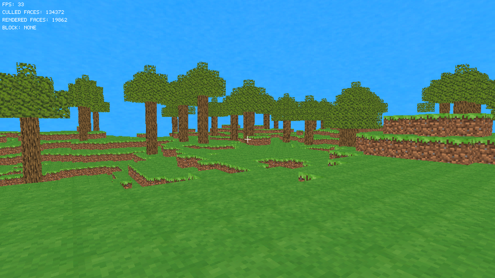
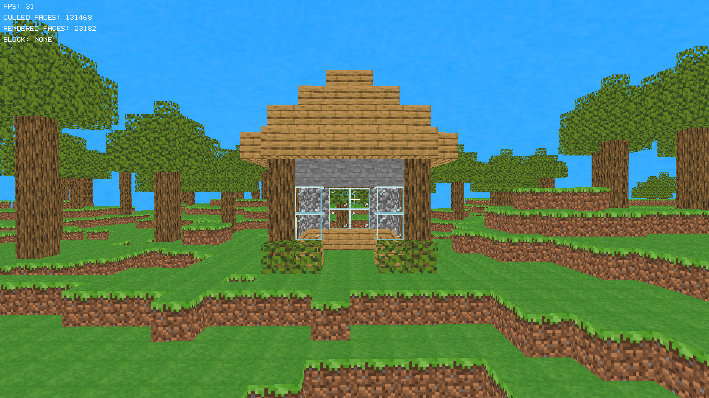

# Minecraft Soft3D

This Project uses my [Soft3D library](https://github.com/SeeGraphics/soft3d) with some small additions to get transparency working. 
I wanted to show off what you can do entirely on the CPU with simple line drawing algorithms and triangles. 

## Screenshots



## Features
- Software rasterizer with textured triangles, depth buffering, and alpha for glass/leaves
- Block palette: grass/dirt/stone, oak logs/planks, cobblestone, glass, leaves
- Simple terrain FBM noise, trees, daytime skybox
- Noclip toggle, wireframe toggle, chunk-based face culling
- HUD crosshair, FPS counters, selected block preview

## Controls
- `WASD` move, `Space` jump, `E` inventory
- Mouse to look, scroll or `0-8` to change block (0 = NONE/air)
- Left click break, right click place 
- `V` noclip, `R` wireframe, `Q` toggle mouse grab, `F` fullscreen, `Esc` quit

## Build & Run
Dependencies: SDL2, SDL2_image, C17 compiler, and the bundled [Soft3D library](https://github.com/SeeGraphics/soft3d).

```bash
make        # builds soft3d lib + game
./build/game
```

