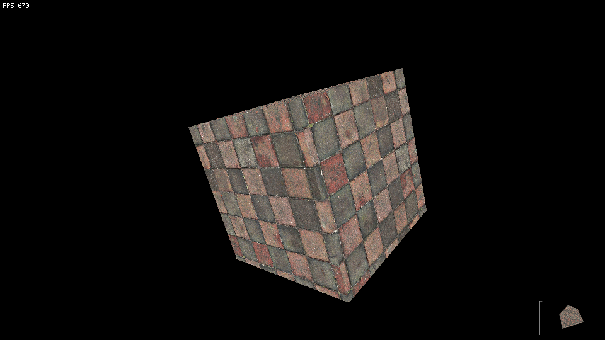
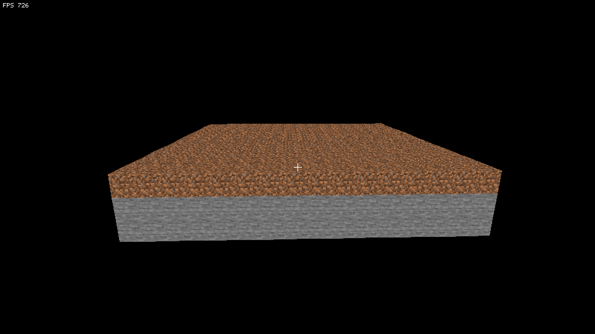

# Soft3d - A Software Rendering library written in C with SDL2

Soft3d is a library capable of rendering 3D shapes, models (.obj) and voxel demos.
Im sure you can expand the small voxel demo to a whole minecraft clone.
You are free to use it in any project you want for any reason, no license. 





## Requirements

- SDL2 (dev)
- SDL2_image (with PNG/WebP support for current assets)
- C17 compiler (Makefile assumes `gcc`)

On macOS with Homebrew:

```sh
brew install sdl2 sdl2_image
```

## Build & Run

```sh
make          # build base cube: build/game
make run      # run cube demo

make mc-run      # run voxel demo
make model-run   # run voxel demo
```

## Controls

Shared controls (cube and voxel demo):

- `WASD` move, `Space` up, `Left Ctrl` down
- Mouse/arrow keys to look
- `R` toggle wireframe mode for model, `Q` toggle mouse grab, `7` toggle fullscreen, `Esc` quit

Voxel demo extras:

- Left click: break block
- Right click: place dirt block
